# Spring Web MVC Task Manager

Основная задача проекта — реализовать REST API для работы с задачами.

## Реализованный функционал

В приложении реализована работа с задачами через HTTP-запросы.

Можно создавать новые задачи, получать список всех задач, находить отдельную задачу по id, изменять её данные и удалять задачи.

Также реализовано изменение только статуса задачи через PATCH-запрос.

Для каждой задачи используются следующие данные:

- id;
- название;
- описание;
- приоритет;
- статус.

Приоритет может иметь значения LOW, MEDIUM и HIGH.

Статус задачи может быть NEW, IN_PROGRESS или DONE.

## REST API

В проекте реализованы следующие запросы:

GET /tasks
GET /tasks/{id}
POST /tasks
PUT /tasks/{id}
PATCH /tasks/{id}/status
DELETE /tasks/{id}

Также есть фильтрация:

GET /tasks?status=NEW
GET /tasks?priority=HIGH

И получение статистики:

GET /tasks/stats

## Создание задачи

Новая задача создаётся с помощью POST-запроса.

После успешного создания сервер возвращает статус `201 Created`.

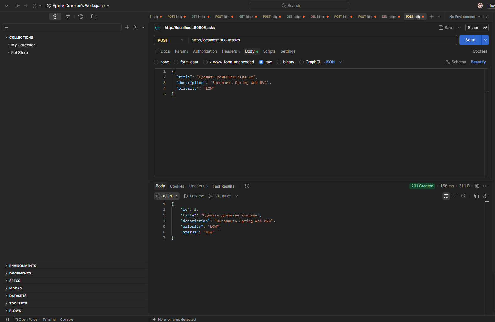

## Получение списка задач

С помощью GET-запроса можно получить все созданные задачи.

При успешном запросе сервер возвращает `200 OK`.

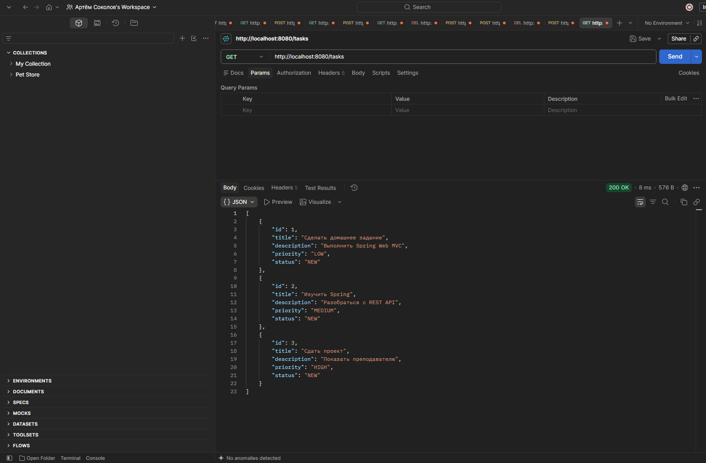

## Получение задачи по ID

Отдельную задачу можно получить по её идентификатору.

Для этого используется запрос:

GET /tasks/{id}

Если задача существует, сервер возвращает `200 OK` и данные задачи в формате JSON.

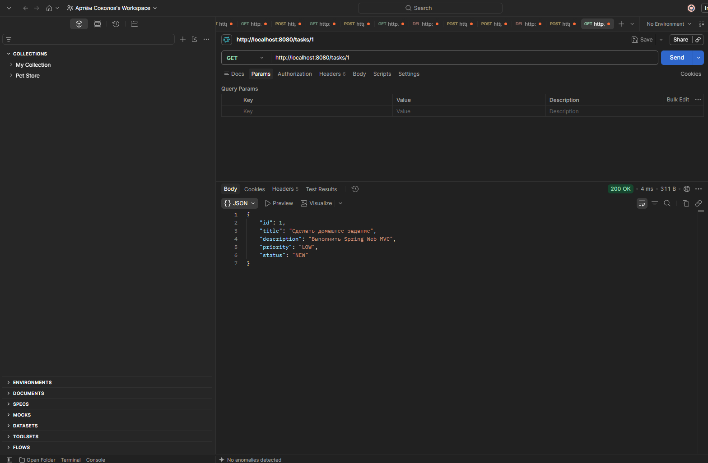

## Обработка ошибки 404

Если запросить задачу с id, которого нет, приложение возвращает `404 Not Found`.

Также возвращается JSON с описанием ошибки.

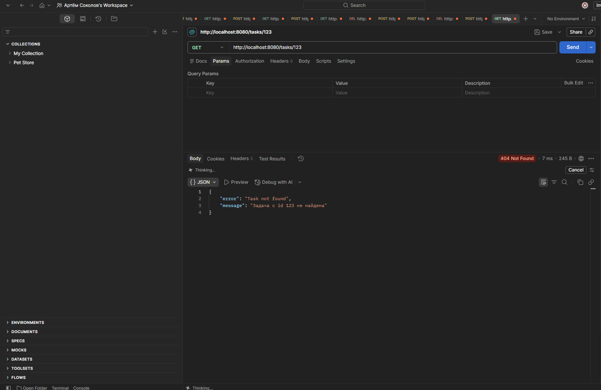

## Изменение задачи

Для полного изменения существующей задачи используется PUT-запрос:

PUT /tasks/{id}

Через него можно изменить название, описание, приоритет и статус задачи.

После успешного изменения сервер возвращает `200 OK`.

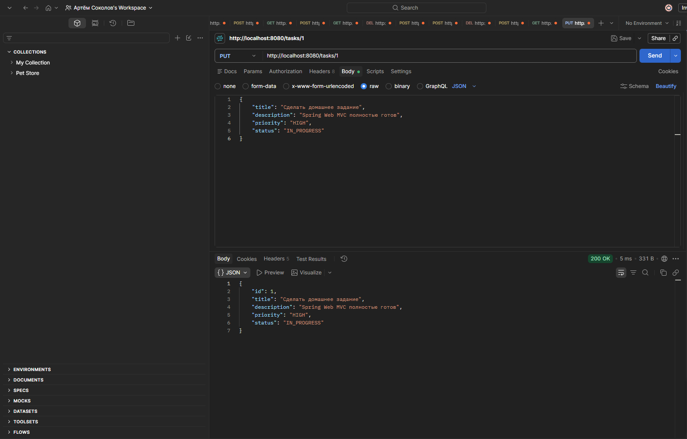

## Изменение статуса задачи

Если необходимо изменить только статус задачи, используется PATCH-запрос:

PATCH /tasks/{id}/status

Например, статус задачи можно изменить с `NEW` на `IN_PROGRESS`, не изменяя остальные данные.

После успешного запроса сервер возвращает `200 OK`.

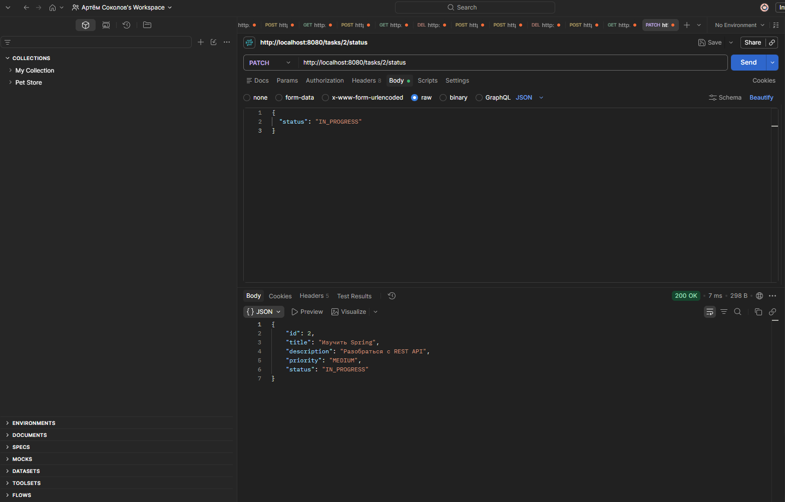

## Фильтрация задач

В приложении реализована фильтрация задач по статусу и приоритету.

Можно получить только задачи с определённым статусом, например `NEW`:

GET /tasks?status=NEW

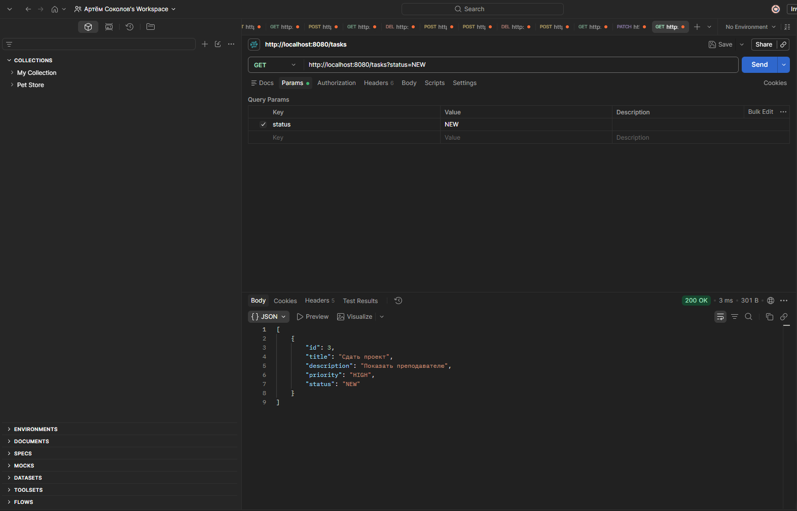

Также можно отфильтровать задачи по приоритету, например `HIGH`:

GET /tasks?priority=HIGH

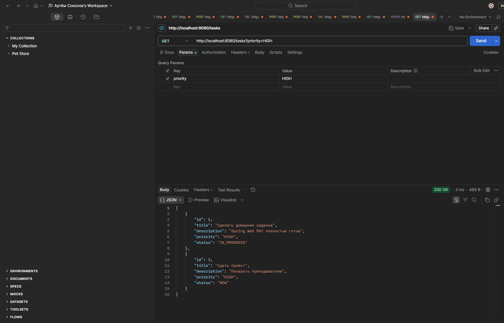

## Статистика

Отдельный запрос позволяет получить количество задач с каждым статусом.

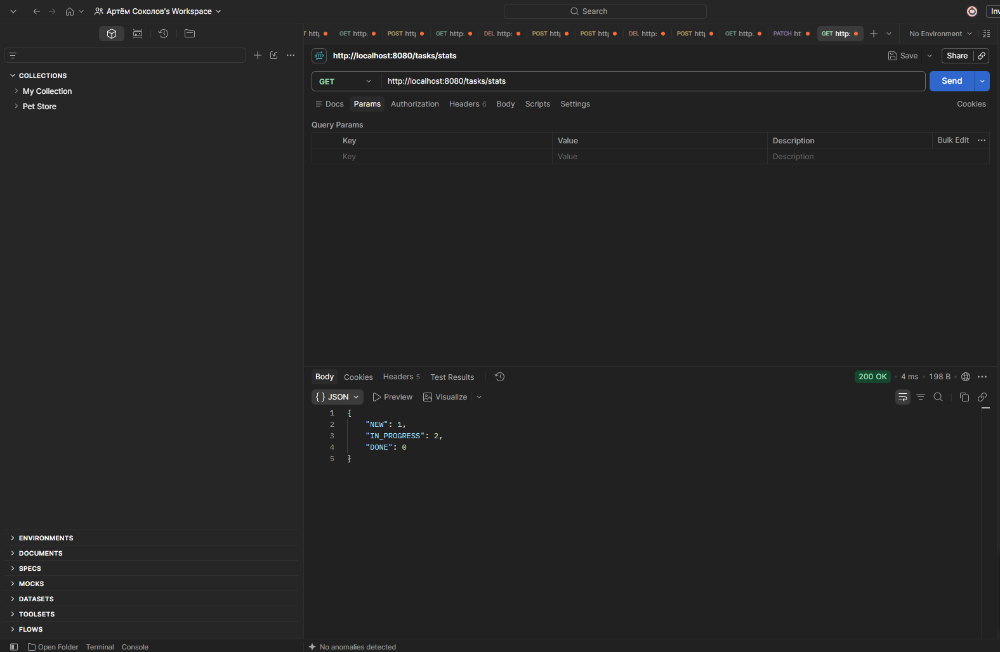

## Удаление задачи

Задачу можно удалить по её id.

После успешного удаления сервер возвращает `204 No Content`.

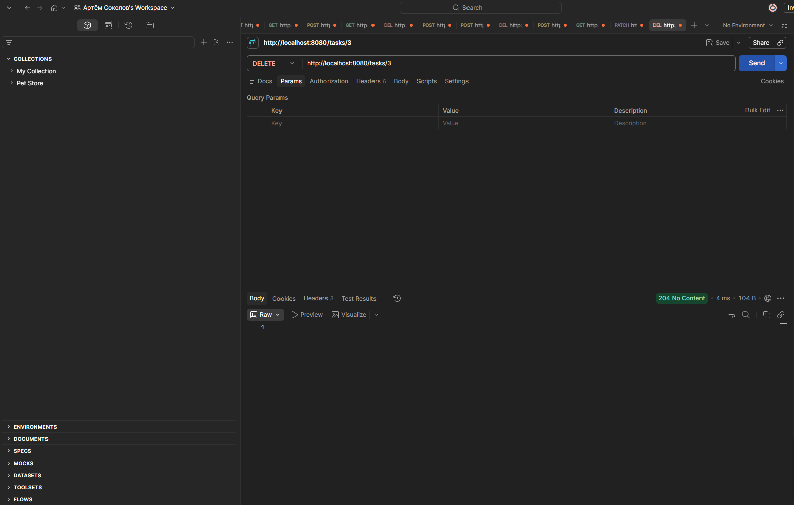

## Обработка неправильных данных

Если при создании задачи передать неправильные данные, например пустое название, приложение возвращает `400 Bad Request`.

Ошибка также возвращается в формате JSON.

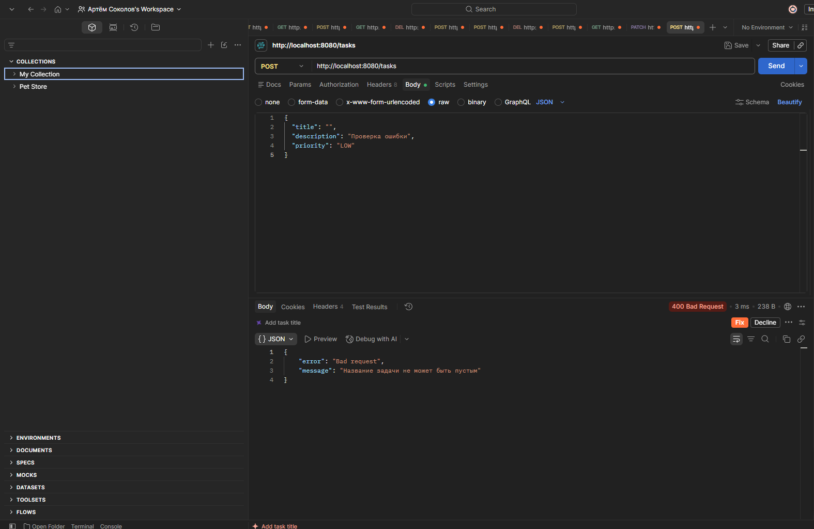

## Обработка ошибок

Для обработки ошибок используется `GlobalExceptionHandler`.

Если задача не найдена, приложение возвращает:

404 Not Found

Если переданы неправильные данные:

400 Bad Request

Благодаря этому вместо стандартной ошибки Spring клиент получает понятный JSON с сообщением.

## Структура проекта

Проект разделён на несколько частей:

controller
service
repository
model
exception
config

`controller` отвечает за HTTP-запросы.

`service` содержит основную логику работы с задачами.

`repository` отвечает за хранение задач.

`model` содержит модель Task.

`exception` содержит исключения приложения.

`config` содержит настройки Spring.

